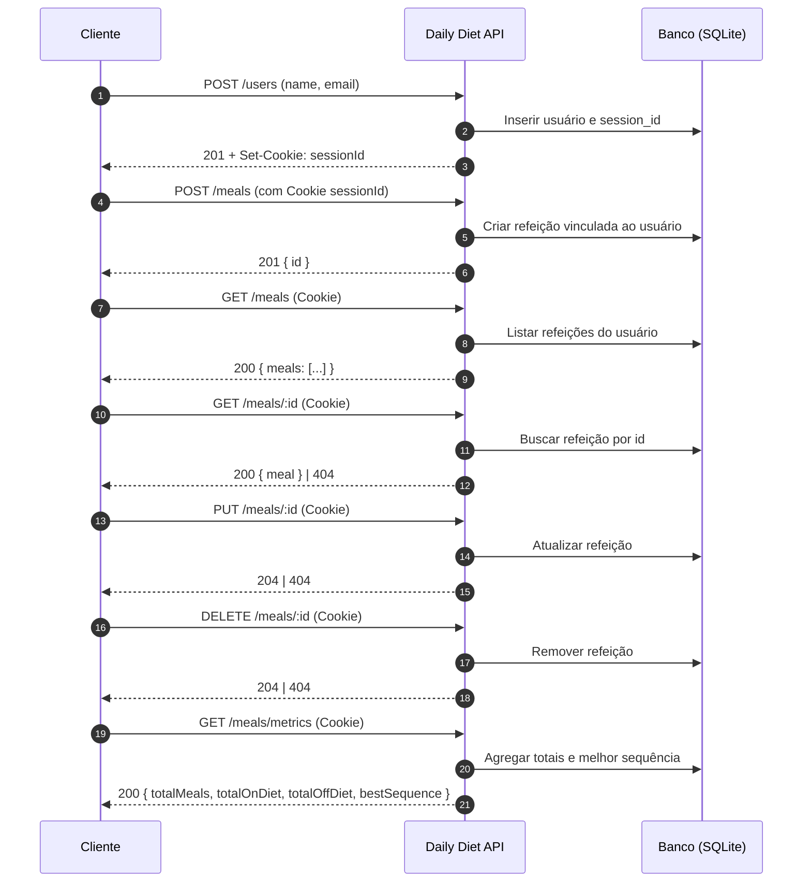

# Daily Diet API

API REST para controle de refeições de usuários, desenvolvida em TypeScript com Fastify, Knex e SQLite. Este repositório implementa o desafio proposto pela Rocketseat, cobrindo criação de usuário, CRUD de refeições e métricas relacionadas à dieta.

## Sumário
- [Visão Geral](#visão-geral)
- [Requisitos do Desafio](#requisitos-do-desafio)
- [Estrutura de Pastas](#estrutura-de-pastas)
- [Como Executar](#como-executar)
- [Scripts Úteis](#scripts-úteis)
- [Variáveis de Ambiente](#variáveis-de-ambiente)
- [Rotas da Aplicação](#rotas-da-aplicação)
- [Testes](#testes)
- [Agradecimento](#agradecimento)

## Visão Geral
- **Runtime**: Node.js 18+/22+
- **Linguagem**: TypeScript
- **Framework**: Fastify 5
- **Banco de dados**: SQLite (via Knex)
- **Validação**: Zod
- **Autenticação de sessão**: Cookie de sessão (`@fastify/cookie`)
- **Testes**: Vitest + Supertest

## Requisitos do Desafio
Os requisitos funcionais e regras de negócio estão documentados em `RULES.md`.

### Fluxo da Aplicação


## Estrutura de Pastas
```
src/
  app.ts           # instancia Fastify, plugins e rotas
  server.ts        # bootstrap do servidor (porta)
  database.ts      # config e instância do Knex
  env/             # validação e carregamento das variáveis
  middlewares/     # verificação de sessionId no cookie
  routes/          # rotas de users e meals
db/
  migrations/      # migrações do Knex
  app.db / test.db # bancos SQLite
```

## Como Executar
1. Requisitos: Node.js 18+ (recomendado 22+), npm
2. Instale dependências:
   - `npm install`
3. Configure o ambiente (`.env`):
   - Exemplo (SQLite):
     ```env
     NODE_ENV=development
     DATABASE_CLIENT=sqlite3
     DATABASE_URL=./db/app.db
     PORT=3333
     ```
4. Execute as migrações do banco:
   - `npm run knex migrate:latest`
5. Suba o servidor em desenvolvimento:
   - `npm run dev`

## Scripts Úteis
- `npm run dev`: Inicia o servidor com reload (tsx)
- `npm run knex`: Atalho para a CLI do Knex (use com subcomandos)
  - `npm run knex migrate:latest`
  - `npm run knex migrate:rollback --all`
- `npm run test`: Executa a suíte de testes (Vitest)
- `npm run lint`: Lint com ESLint (corrige quando possível)
- `npm run build`: Compila com tsup

## Variáveis de Ambiente
Gerenciadas por `dotenv` e validadas com Zod em `src/env`.
- `NODE_ENV`: development | test | production (default: production)
- `DATABASE_CLIENT`: ex.: `sqlite3`
- `DATABASE_URL`: ex.: `./db/app.db`
- `PORT`: ex.: `3333`

Para testes, o projeto usa `.env.test` automaticamente quando `NODE_ENV=test`.

## Rotas da Aplicação
Prefixos registrados em `src/app.ts`:
- `POST /users`
  - Body: `{ name: string, email: string }`
  - 201: `{ id: string }`
  - Define `Set-Cookie: sessionId` (7 dias) quando não existir

- `POST /meals` (requer Cookie `sessionId`)
  - Body: `{ name: string, description: string, datetime: Date|string, isOnDiet: boolean }`
  - 201: `{ id: string }`

- `GET /meals` (requer Cookie)
  - 200: `{ meals: Array<Meal> }`

- `GET /meals/:id` (requer Cookie)
  - 200: `{ meal: Meal }` | 404

- `PUT /meals/:id` (requer Cookie)
  - Body: igual ao POST
  - 204: sem corpo | 404

- `DELETE /meals/:id` (requer Cookie)
  - 204: sem corpo | 404

- `GET /meals/metrics` (requer Cookie)
  - 200: `{ totalMeals: number, totalOnDiet: number, totalOffDiet: number, bestSequence: number }`

Observação: O controle de sessão é simplificado via cookie de sessão não autenticado, suficiente para atender ao escopo do desafio.


## Testes
Execute a suíte:
```
npm run test
```
Os testes utilizam rollback e reaplicação de migrações a cada caso para isolar o estado.

## Agradecimento
Obrigado, Rocketseat, pela proposta do desafio e pela curadoria de conteúdos que incentivam o aprendizado contínuo. 💜


